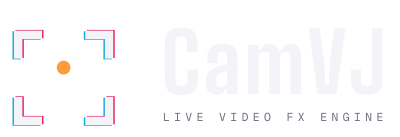

<p align="center">
  
</p>

# CamVJ

Motor de efeitos de vídeo ao vivo. Uma câmera entra, a GPU trata, o quadro
sai para um painel de LED, um projetor ou — no Windows, a partir do M1 — de
volta a um switcher Blackmagic ATEM.

**Estado: M0 feito; M1 em andamento.** Núcleo GPU com dois backends atrás de
uma interface comum — **Metal (macOS)** e **Direct3D 11 (Windows)** — em
1920×1080, quatro efeitos, UI ImGui, self-test headless. As entradas de vídeo
ficam atrás de `VideoSource`: padrão de teste, webcam interna e câmeras USB
(no macOS 14+ também iPhone via Continuity). É essa a interface que o DeckLink
vai implementar no M1.

O primeiro passo do M1 é a descoberta de dispositivos DeckLink por comando,
implementada e aguardando validação de build e placa no Windows. Ainda
**não há** captura/saída SDI, ATEM, presets, MIDI nem áudio. Windows é a
plataforma de produção (SDKs da Blackmagic). macOS é desenvolvimento e
demonstração.

```bash
cmake -S . -B build -DCMAKE_BUILD_TYPE=Release && cmake --build build -j8
./build/bin/atem_fx                                      # app com interface
./build/bin/atem_fx --headless --frames 200              # gate de toda mudança
./build/bin/atem_fx --headless --frames 300 --dump f.ppm
./build/bin/atem_fx --list-sources                       # entradas de vídeo
./build/bin/atem_fx --list-displays                      # telas de saída
./build/bin/atem_fx --output 2                           # manda o programa para a tela 2
./build/bin/atem_fx --check-shaders                      # compila todos os shaders
```

No macOS o binário fica em `build/bin/atem_fx.app` (o bundle é o que permite o
acesso à câmera); `build/bin/atem_fx` é um symlink para dentro dele.

Windows:

```bat
cmake -S . -B build -G "Visual Studio 17 2022" -A x64
cmake --build build --config Release
build\bin\Release\atem_fx.exe
```

## Baixar (macOS e Windows)

Há **duas builds** — escolha a do seu sistema. Os arquivos saem nos
[Releases do GitHub](https://github.com/antonioreal97/CamVJ/releases)
(pacotes **não assinados** nesta etapa).

| Sistema | Arquivo | O que fazer |
| ------- | ------- | ----------- |
| **macOS** (Apple Silicon ou Intel, 11+) | `CamVJ-<versão>-macos.dmg` | Abrir o DMG → arrastar **CamVJ** para **Applications** → abrir o app |
| **Windows** (x64, 10 1703+) | `CamVJ-<versão>-windows-x64.zip` | Extrair a pasta → abrir `CamVJ/CamVJ.exe` |

Exemplo na versão `0.1.0`: `CamVJ-0.1.0-macos.dmg` e
`CamVJ-0.1.0-windows-x64.zip`.

**macOS.** Na primeira abertura, se o Gatekeeper bloquear: clique direito no
app → **Abrir**. Autorize a câmera quando pedido (ou em **Ajustes do Sistema ›
Privacidade e Segurança › Câmera**).

**Windows.** Se o SmartScreen avisar: **Mais informações** → **Executar
assim mesmo** (só se você confiar na build). A pasta `shaders/` precisa
ficar ao lado do `CamVJ.exe` — não mova só o executável.

Quem gera os pacotes a partir do código: após o build Release,
`./scripts/package_macos.sh` (no Mac) ou
`powershell -ExecutionPolicy Bypass -File .\scripts\package_windows.ps1`
(no Windows). Detalhes em
[docs/BUILD.md](docs/BUILD.md#distribution-packages).

## O que o M0 faz

```text
TestPatternSource (GPU) → EffectChain → Preview ImGui  ou  dump PPM
                                      → tela de saída (HDMI/DisplayPort)
```

Efeitos: `passthrough`, `rgb_split`, `pixelate`, `fm_raster`, `subpixel`,
`shutter`, `crt`, `mirror` e `auto_frame` (HLSL + MSL).
Processamento sempre em 1920×1080, independente do tamanho da janela.
Orçamento: 16,68 ms/frame (59,94 fps). A taxa não é travada no display.

CLI: `--headless`, `--frames N`, `--dump PATH`, `--enable a,b,c`,
`--no-vsync`, `--source ID`, `--list-sources`, `--output ID`,
`--list-displays`, `--list-decklink`, `--help`.
Detalhes em [docs/BUILD.md](docs/BUILD.md).

## Efeitos em loop

Cada parâmetro de cada nó de efeito pode ter seu próprio loop. Em **EFFECTS**,
selecione um efeito e ative **Loop** no parâmetro que deseja animar. Abra
**Loop settings** para escolher a onda em **Shape**, os valores mínimo e
máximo, a duração do ciclo em segundos e a fase em **Phase (%)**. A curva
mostra o movimento configurado.

Por exemplo, no **RGB Split**, configure **Amount** com onda **Sine**, mínimo
`0`, máximo `0.3` e **Cycle (s)** em `4`: a separação de cores aumenta e diminui
continuamente a cada quatro segundos. **Angle** pode ter outro loop, com
**Ramp up**, de `0` a `360`, para girar a direção. Parâmetros inteiros avançam
em valores inteiros e opções de ligar/desligar também podem ser automatizadas.

Use **Pause/Resume** para congelar ou continuar um loop e **Restart** para
recomeçar o ciclo na fase configurada. Desativar **Loop** recupera o valor
manual anterior; ativá-lo novamente retoma a fase. O reset do parâmetro, com
clique direito no controle, restaura o padrão e remove seu loop.
Enquanto o loop está ativo, o controle mostra o valor animado e o ajuste
manual fica desabilitado.

Os loops continuam quando você seleciona outro efeito, reorganiza os nós ou
desliga o efeito na cadeia. Instâncias do mesmo efeito têm controles
independentes. As configurações valem apenas para a sessão e são perdidas ao
encerrar o aplicativo; salvá-las em presets continua previsto para M3.

## Enquadramento automático (Auto Frame)

Segue uma pessoa ou objeto e mantém o enquadramento, para mandar uma câmera de
palco a um painel de LED sem alguém pilotando o corte. Em **EFFECTS**, adicione
**Auto Frame**. Com **Follow Subject** ligado, o efeito recorta e move o
recorte sozinho; desligado, ele vira um crop manual com **Manual Zoom**,
**Manual X** e **Manual Y**.

Os controles são de operador de câmera, não de algoritmo:

| Controle | O que faz |
| -------- | --------- |
| Subject Size | Quanto da altura do quadro a pessoa ocupa. Maior é mais fechado. |
| Headroom | Espaço acima da cabeça. |
| Dead Zone | Quanto ela pode andar antes do quadro se mexer. **É o que impede a imagem de tremer.** |
| Smoothing (s) | Tempo para o quadro alcançar o alvo. |
| Max Speed | Velocidade máxima do movimento. |
| Hold (s) | Quanto tempo segura o quadro quando perde a pessoa. |
| Return (s) | Tempo para abrir de volta ao quadro cheio depois disso. |
| Max Zoom | Limite de aproximação. |

Perder a pessoa não é emergência: o quadro **segura** por `Hold` segundos —
alguém que vira de costas não justifica um movimento — e só então abre de
volta, suave. O recorte nunca sai do quadro: quem anda para a borda sai do
centro em vez de aparecer tarja preta no painel.

Cuidado com resolução: recortar joga pixels fora. Com 1920×1080 na entrada,
Max Zoom 1,8 manda cerca de 1067×600 pixels reais para uma saída 1080p, com
upscale — e o processador do painel costuma escalar de novo. `Max Zoom` é o
controle que decide quanta perda é aceitável.

A linha **Tracking** abaixo da entrada mostra o que o detector está vendo.
No macOS ele usa o framework Vision e precisa de permissão de câmera
(Ajustes do Sistema → Privacidade e Segurança → Câmera). **No Windows ainda
não existe detector**: o efeito funciona, mas só nos controles manuais. Os
detalhes e as opções estão em [docs/TRACKING.md](docs/TRACKING.md).

## Saída para uma tela (LED, projetor, segundo monitor)

O quadro processado sai por uma **janela sem bordas em tela cheia** na tela que
você escolher. Para o que estiver do outro lado do cabo — um processador de
LED, um projetor, a entrada HDMI de um switcher — isso é um sinal de vídeo como
qualquer outro: sem barra de título, sem cursor, sem interface. É o mesmo lugar
que um computador de Resolume ocupa em um evento: você manda um sinal, o
mapeamento para os painéis é do outro lado.

```bash
./build/bin/atem_fx --list-displays
```

```text
ID         NAME                           RESOLUTION   REFRESH
1          Built-in Retina Display        3024x1964    120.00 Hz  (primary)
2          LG ULTRAGEAR                   1920x1080    144.00 Hz
```

No painel **OUTPUT**, logo abaixo de SOURCE, escolha a tela na lista. O envio
começa na hora. **Stop output** e a opção **No output** encerram; a tecla
**Escape** também, e é por isso que ela existe: se você mandar a saída para a
tela onde está a interface, a janela cobre tudo, inclusive o botão de parar.
Por linha de comando, `--output 2` já começa enviando.

O processamento é sempre 1920×1080. Se a tela tiver outra proporção, a imagem
entra inteira com barras pretas (*fit*) — nunca esticada, porque distorção é o
tipo de erro que ninguém consegue corrigir mais adiante na cadeia.

**Com uma saída ativa, ela passa a ser o relógio.** A janela de preview para de
esperar o próprio monitor: esperar dois vsyncs que nunca concordam de fase é
como se transformam dois monitores de 60 Hz em 30 fps. A caixa de vsync no
cabeçalho deixa de valer enquanto a saída estiver no ar, e o painel diz isso.

Medido em um M4 com painel de 1920×1080 a 144 Hz, padrão de teste e um efeito,
seis séries de 600 quadros: **112 a 116 fps**, quadro de CPU entre 8,6 e
8,9 ms. Desse tempo, o processamento na GPU é **menos de 1 ms** — o resto é
espera pelo vsync da tela, que é exatamente o que se quer. Para os 59,94 fps
que o projeto persegue, sobra muita folga.

O que isso **não** é: não é SDI, não é genlock e não é DeckLink. A tela é um
display, e o sistema operacional o entrega no ritmo dele. Para uma parede de
LED atrás de um processador isso é normal e é assim que se trabalha. Para
devolver um sinal limpo à entrada de um ATEM, o caminho continua sendo o M1.

## Descoberta DeckLink (Windows)

O build padrão dispensa o SDK. Para habilitar a descoberta, use o SDK
DeckLink externo da Blackmagic e execute no **x64 Native Tools Command Prompt
for VS 2022**, com o Windows SDK instalado:

```bat
cmake -S . -B build -G "Visual Studio 17 2022" -A x64 -DATEMFX_ENABLE_DECKLINK=ON -DATEMFX_DECKLINK_SDK_DIR="C:\SDKs\DeckLink SDK"
cmake --build build --config Release
build\bin\Release\atem_fx.exe --list-decklink
```

O comando lista nomes, capacidades de captura/saída e conexões de vídeo
suportadas e encerra sem abrir a interface nem inicializar a GPU. Essas
capacidades não indicam sinal conectado. Não combine `--list-decklink` com
opções de renderização, `--list-sources` ou `--check-shaders`.

Enumeração bem-sucedida retorna 0, mesmo sem placas. SDK desabilitado,
macOS ou falha de driver/enumeração retornam 1; uso inválido retorna 2.
Metadados incompletos geram avisos. A validação Windows com placa ainda está
pendente; não há captura, playback ou monitoramento de conexão/desconexão.

## Documentação

| Documento | O que é |
| --------- | ------- |
| [AGENTS.md](AGENTS.md) | Constituição. Precedência sobre prompts. |
| [docs/ARCHITECTURE.md](docs/ARCHITECTURE.md) | Estrutura, RHI, threading |
| [docs/RUNTIME.md](docs/RUNTIME.md) | `main` → `renderFrame`, ownership, mapa de arquivos |
| [docs/EFFECT_SYSTEM.md](docs/EFFECT_SYSTEM.md) | Como adicionar um efeito |
| [docs/TRACKING.md](docs/TRACKING.md) | Tracking de pessoa/objeto e enquadramento |
| [docs/VIDEO_PIPELINE.md](docs/VIDEO_PIPELINE.md) | Pipeline M0 + contrato M1 |
| [docs/ATEM_INTEGRATION.md](docs/ATEM_INTEGRATION.md) | Design M4 (não implementado) |
| [docs/PRODUCT.md](docs/PRODUCT.md) | Meta V1 vs o que existe |
| [docs/ROADMAP.md](docs/ROADMAP.md) | Milestones e backlog |
| [docs/BUILD.md](docs/BUILD.md) | Build, CLI, shaders, debug |
| [docs/VISION.md](docs/VISION.md) | Ensaio original. **Não é o mapa do repo.** |
| [memory-bank/](memory-bank/) | Memória de trabalho dos agentes (PT-BR) |

## Marco atual

**M1 — DeckLink IN → GPU → DeckLink OUT**, Windows. Próximo passo: validar
FX-010 no Windows; depois avançar com captura, playback, filas e timing.
ATEM, MIDI, áudio e presets pertencem aos milestones seguintes.

## Licença / nome

O produto é **CamVJ**. O binário e o namespace de código continuam `atem_fx` /
`atemfx` — isso é o motor, não a marca. ATEM é marca registrada da Blackmagic
Design.
